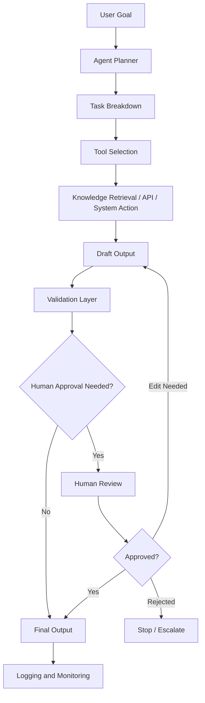

# Agentic AI Workflow Diagram

This diagram shows a general agentic AI workflow with planning, tool use, validation, and human approval.

## Key Principle

Agentic AI should be designed with clear roles, limited tool access, validation, monitoring, and human approval for sensitive workflows.
